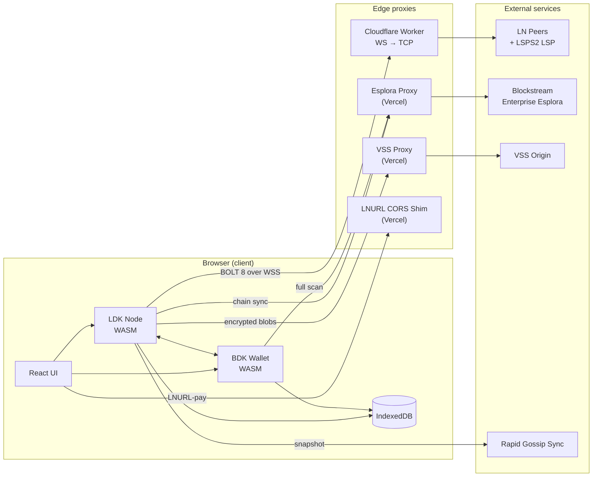

# Zinqq

> A self-custodial Bitcoin Lightning wallet that runs entirely in your browser.

> [!WARNING]
> **Experimental software on Bitcoin mainnet.** Zinqq is under active
> development; storage layouts, channel-state formats, and external interfaces
> can change between commits. Use only amounts you can afford to lose, and back
> up your 12-word seed before funding the wallet.

---

## Why Zinqq

Zinqq is a working answer to a single question: what does a Bitcoin Lightning
wallet look like if it trusts nothing outside the device it runs on? No
custodian, no server-side signing, no native install, and no hidden on-chain
fallback.

- **Browser-only.** LDK and BDK both ship as WebAssembly; every signing
  operation happens client-side. Zinqq installs as a PWA on iOS, Android, and
  desktop, but it doesn't require installation to run.
- **Self-custodial by construction.** The BIP 39 seed never leaves the device.
  The cross-device backend (VSS) sees only ChaCha20-Poly1305-encrypted blobs
  with hashed keys; request authentication is a secp256k1 signature, not a
  password.
- **Lightning-first.** Payments always attempt Lightning. On-chain exists as an
  escape hatch — for example, the BIP 321 URI Zinqq generates on receive bundles
  an on-chain address alongside a BOLT 11 invoice — and is never a silent
  fallback.
- **Instant inbound via LSPS2.** A user's first receive doesn't need manual
  channel management: Zinqq buys a just-in-time channel from a configured LSP
  the moment inbound liquidity is needed.
- **Anchor channels with a proactive reserve.** A small on-chain balance stays
  available for CPFP fee-bumping at force-close, and a dedicated recovery flow
  walks the user through topping it up if the reserve is ever exhausted.
- **Encrypted cross-device restore.** Restore from the 12-word seed alone and
  Zinqq rebuilds channel monitors, channel manager, scorer, network graph, and
  known peers from VSS — no manual static-channel-backup juggling.
- **Unified send UX.** One input box classifies BIP 321 URIs, BOLT 11 invoices,
  BOLT 12 offers, BIP 353 human-readable names, LNURL-pay, and raw on-chain
  addresses, and routes each one to the right review screen.

## What it does

### Send & Receive

- Unified send accepts BIP 321, BOLT 11, BOLT 12, BIP 353, LNURL-pay, and
  on-chain addresses (`src/ldk/payment-input.ts`).
- Receive produces a single QR that combines an on-chain address and a BOLT 11
  invoice in a BIP 321 URI. BOLT 12 offers have their own view.
- Just-in-time inbound liquidity via LSPS2: when a requested invoice exceeds
  available inbound capacity, Zinqq negotiates a channel purchase with the LSP
  and encodes the SCID and route hint into the invoice (`src/ldk/lsps2/`).
- Camera-based QR scanning for any of the supported payment inputs.

### Channels & liquidity

- Connect, disconnect, and forget peers from the Advanced screen.
- Open channels with chosen peers and pick the funding amount.
- Close channels gracefully; force-close when the remote is unresponsive.
- Force-close recovery flow detects stuck balances and prompts for a small
  on-chain top-up so anchor-output CPFP can unstick the channel.
- Automatic on-chain anchor reserve kept aside for fee bumping
  (`src/onchain/context.tsx`).
- Spendable-output sweeping via `KeysManager.spend_spendable_outputs` whenever
  the node sees claimable outputs (`src/ldk/sweep.ts`).

### Backup & recovery

- 12-word BIP 39 mnemonic with a 60-second auto-hide reveal.
- Encrypted VSS sync of channel monitors, channel manager, network graph,
  scorer, known peers, payment history, and the BOLT 12 offer
  (`src/ldk/storage/vss-client.ts`).
- Restore from seed on a fresh device: Zinqq pulls the encrypted state from VSS,
  decrypts locally with the key derived from the mnemonic, and reconstructs the
  LDK node.

### Progressive web app

- Installable manifest with an iOS "Add to Home Screen" hint on first launch.
- Workbox service worker caches the app shell for offline launch and uses a
  NetworkFirst strategy for the LDK WASM blob.
- An update banner surfaces new service-worker releases without a hard refresh.

## How it works

Zinqq runs in three tiers: a browser-side runtime that does all signing and
state management, a small set of edge proxies that grant the browser access to
TCP peers and authenticated chain data, and the external services those
proxies reach.

### Browser

- **UI:** React 19 + TypeScript 5.9, React Router v7, Tailwind v4, built by
  Vite 7 with `vite-plugin-wasm`, `vite-plugin-top-level-await`, and
  `vite-plugin-pwa`.
- **LDK node:** `lightningdevkit` 0.1.8-0 (~12 MB WASM) with custom JS trait
  implementations for the logger, fee estimator, broadcaster, persister,
  filter, event handler, signer provider, and wallet source
  (`src/ldk/traits/`). Running components include `ChainMonitor`,
  `ChannelManager`, `NetworkGraph`, `ProbabilisticScorer`, `OnionMessenger`,
  `PeerManager`, and `P2PGossipSync`.
- **BDK wallet:** `@bitcoindevkit/bdk-wallet-web` 0.3.0 (WASM) manages BIP 84
  descriptors for the on-chain escape hatch. LDK pulls UTXOs and signs through
  BDK via the shared wallet source trait.
- **Local state:** IndexedDB (`src/storage/idb.ts`) is the primary persistence
  layer; every persisted blob is mirrored to VSS in encrypted form so that a
  second device can rebuild from it.
- **Key hierarchy:** BIP 39 mnemonic → BIP 32 master → separate hardened
  derivations for the LDK seed (`m/535'/0'`), VSS encryption key
  (`m/535'/1'`), VSS signing key (`m/535'/2'`), and BDK BIP 84 descriptors
  (`m/84'/0'/0'`). See `src/wallet/keys.ts`.

### Edge proxies

- **Cloudflare Worker WS→TCP bridge** (`proxy/`) — the browser cannot open raw
  TCP sockets, so BOLT 8 peer transport goes over
  `wss://proxy.zinqq.app/<host>:<port>` to a Cloudflare Worker that proxies
  bytes to the real Lightning peer. Origin and port lists are allowlisted.
- **Esplora proxy** (`api/esplora-proxy.ts`) — Vercel serverless function that
  adds OAuth2 credentials to requests bound for Blockstream Enterprise
  Esplora. Both LDK's chain sync and BDK's full scan flow through it.
- **VSS proxy** (`api/vss-proxy.ts`) — thin pass-through to the VSS origin.
  Auth is a client-signed token; the proxy adds no trust.
- **LNURL CORS shim** (`api/lnurl-proxy.ts`) — CORS workaround so the browser
  can reach arbitrary LNURL endpoints during an LNURL-pay flow.

### External services

- **Lightning peers and the LSPS2 LSP** — peers Zinqq connects to for payment
  routing, including the configured LSP for just-in-time channel purchase.
- **Blockstream Enterprise Esplora** — chain data (blocks, transactions,
  UTXOs, fee estimates).
- **VSS origin** — encrypted cross-device state store. Zinqq never trusts it
  with plaintext.
- **Rapid Gossip Sync** — the LDK public snapshot at
  `rapidsync.lightningdevkit.org` seeds the network graph.

The Content-Security-Policy in `index.html` enumerates every external host the
app is allowed to reach; it's the tightest inventory of network dependencies
in the codebase.

## Upcoming

Features on the near-term roadmap. Not yet shipped — linked plan docs track
status.

- **BIP 353 human Bitcoin address (receive).** Zinqq already resolves BIP 353
  addresses on the send side. The upcoming receive-side feature lets users
  claim a human-readable address like `alice@zinqq.app` that resolves via a
  DNSSEC-signed TXT record to their BOLT 12 offer, so they can share a
  memorable name instead of a raw `lno1…` string. See
  [`docs/plans/2026-03-28-001-feat-bip353-receive-dns-payment-address-plan.md`](docs/plans/2026-03-28-001-feat-bip353-receive-dns-payment-address-plan.md).
- **Offline receive via LSPS5.** Today, receiving a Lightning payment requires
  Zinqq to be online either to claim a just-in-time channel (LSPS2) or to
  answer an HTLC. [LSPS5](https://github.com/BitcoinAndLightningLayerSpecs/lsp)
  defines async receive: the LSP holds the HTLC on the user's behalf while the
  wallet is offline and settles once it comes back. This closes the last gap
  in the lightning-first philosophy — every invoice eventually settles over
  Lightning, even if the wallet was closed when it was created.
